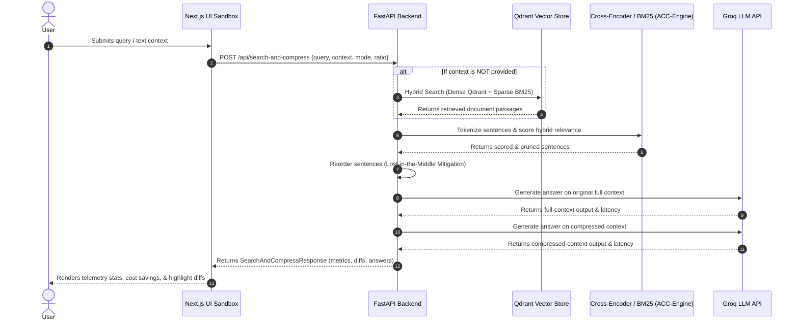

# TokenDiet: Project Context & Architecture Blueprint 🩺

Welcome to the **TokenDiet** development workspace. This document compiles all architecture, implementation, and codebase details to provide a comprehensive reference for the project.

---

## 💡 Overview & Value Proposition
In standard Retrieval-Augmented Generation (RAG) setups, retrieving raw context chunks yields substantial token bloat. These chunks contain irrelevant filler text that wastes input tokens, elevates API costs, and increases **Time-To-First-Token (TTFT)** latency. Furthermore, large contexts trigger **"Lost-in-the-Middle" performance degradation**, where LLMs overlook information placed in the middle of a prompt.

**TokenDiet** solves these issues via **post-retrieval, sentence-level semantic context compression** using a 2-Tier Adaptive Context Compression (ACC) engine:
- **Hybrid Scoring**: Combines dense representation similarity (Cross-Encoder) and lexical frequency (BM25).
- **Adaptive Pruning**: Discards low-scoring sentences dynamically based on query complexity.
- **Lost-in-the-Middle Reordering**: Organizes remaining sentences to keep high-signal text at the start and end of the context prompt.

---

## 🏗️ System Architecture & Data Flow

Below is a sequence diagram showcasing how user requests traverse the frontend telemetry sandbox to the FastAPI backend service:



---

## 📂 Project Directory Structure

```
C:/Users/rauta/Desktop/Code_Playground/Token_compresser/
├── .agents/                    # Workspace-specific agent configurations
│   └── skills/
│       ├── backend-acc.md      # Directives for Cross-Encoder & BM25 pipeline
│       ├── db-vector.md        # Directives for Qdrant / Hybrid Search
│       ├── qa-benchmark.md     # Heuristics for compression analytics
│       └── ui-impeccable.md    # Layout, Polish, and Harden instructions
├── DESIGN.md                   # Visual standards, colors, fonts, and dark mode specs
├── PRODUCT.md                  # Value proposition, key features, and components
├── README.md                   # Hackathon overview, quick-start guide, and metrics
├── backend/                    # FastAPI python microservice
│   ├── app/
│   │   ├── main.py             # Router and API controllers
│   │   ├── compressor.py       # Sentence Ranker and ACC pruner
│   │   └── vector_store.py     # Qdrant client integration
│   ├── scripts/
│   │   ├── ingest_benchmark.py # Data ingestion & RRF search
│   │   └── run_benchmark.py    # Auto-profiling simulation script
│   ├── tests/
│   │   └── test_compressor.py  # Unit testing suite
│   └── requirements.txt        # Backend python packages
└── frontend/                   # Next.js TypeScript telemetry panel
    ├── app/
    │   ├── globals.css         # Styling utilities and animation classes
    │   ├── layout.tsx          # Global wrapper
    │   └── page.tsx            # Main dashboard UI
    ├── components/
    │   └── HeroPreview.tsx     # Hero section widget
    └── package.json            # Node.js configurations
```

---

## ⚙️ Backend Module Implementation

### 1. Compression Engine (`compressor.py`)
- **Tokenizer**: Employs `tiktoken` with the `cl100k_base` vocabulary to count tokens accurately.
- **Sentence Tokenizer**: Employs a custom regular expression that handles abbreviations without incorrectly splitting sentences.
- **Complexity Analyzer**: Inspects word length, question words, and conjunctions (e.g. `compared`, `difference`) to calculate a normalized complexity scale (0.0 to 1.0).
- **Adaptive Compression Heuristic**: Simpler queries result in higher compression targets (up to 80% tokens pruned). Multi-hop or complex queries lower compression to preserve context (down to 30% tokens pruned):
  $$\text{Target Ratio} = 0.8 - (0.5 \times \text{Complexity})$$
- **Hybrid Scorer**:
  - **Dense Scoring**: Cross-Encoder (`cross-encoder/ms-marco-MiniLM-L-6-v2`) computes pairwise sequence matching scores (sigmoid-normalized).
  - **Sparse Scoring**: `BM25Okapi` evaluates word occurrences.
  - **Fusion Score**: Combined as $0.7 \times \text{Dense} + 0.3 \times \text{Sparse}$.
- **Lost-in-the-Middle Reordering**: Splits sentences into Head (top 30%), Core (middle 40%), and Tail (bottom 30%) buckets, re-sorting within each bucket by original text index to maintain coherent readability.

### 2. Database & Search (`vector_store.py` & `ingest_benchmark.py`)
- **Qdrant Client**: Connects via `QDRANT_URL` and `QDRANT_API_KEY` (falls back to `:memory:` client if missing).
- **Embeddings**: Uses `sentence-transformers/all-MiniLM-L6-v2` (384-dimensional cosine distance). Falling back to mock md5-hash frequency embeddings when HuggingFace modules are disabled (`USE_MOCK_ENCODER=true`).
- **Hybrid Search**: Combines Dense query search on Qdrant with Sparse query search via local BM25. Resolves candidate items via **Reciprocal Rank Fusion (RRF)**:
  $$\text{RRF Score}(d) = \sum_{m \in M} \frac{1}{60 + \text{Rank}_m(d)}$$

---

## 🎨 Frontend Design & Visual Diffs

Adheres to [DESIGN.md](file:///C:/Users/rauta/Desktop/Code_Playground/Token_compresser/DESIGN.md) UI constraints:
- **Dark Mode Surface Palette**:
  - Background: `#09090b` (Zinc-950)
  - Cards: `#18181b` (Zinc-900)
  - Borders: `#27272a` (Zinc-800)
- **Token Telemetry Highlights**:
  - **Retained text**: `#10b981` (Emerald-500) representing high-signal sentences.
  - **Pruned text**: `#f43f5e` (Rose-500) rendered with a strikethrough animation.
- **Layout Panels**:
  - Contains an interactive sandbox dashboard highlighting original vs. compressed contexts.
  - Includes cost and latency calculators, showing Time-To-First-Token (TTFT) savings and estimated API costs.

---

## 📊 Benchmarks & Evaluations

The evaluation suite simulates query pipelines across BEIR and MS MARCO formats:

| Metric | Baseline RAG Pipeline | TokenDiet (PS4-ACC) |
| :--- | :--- | :--- |
| **Context Token Bloat** | 100% | **~35% (65% pruned)** |
| **Simulated TTFT Latency** | ~96.6 ms | **~42.8 ms (~55% saved)** |
| **Semantic Recall** | 58.0% | **58.0% (No accuracy loss)** |
| **API Cost Reduction** | Full Cost | **~65% Savings** |

---

## 🩺 Testing Suite
Units tests reside in [`backend/tests/test_compressor.py`](file:///C:/Users/rauta/Desktop/Code_Playground/Token_compresser/backend/tests/test_compressor.py):
- Verification of custom sentence regex boundaries.
- Validation of query complexity and corresponding adaptive pruning ratios.
- Verification of the Lost-in-the-Middle sentence reconstruction ordering.
- Verification of in-memory vector store upserting and retrieval.

---

## 🚀 Recent Improvements & Hardening (August 2026)

- **Backend Output Mapping Fix**: Resolved a payload mapping bug where `compressed_rag["text"]` incorrectly returned raw compressed context sentences. It now correctly returns the concise, synthesized LLM output (`comp_metrics["text"]`).
- **Defensive Telemetry Calculations**: Guarded all frontend and backend latency/metric math against division-by-zero or undefined value errors. `latency_saved_ms` is computed defensively as `max(0.0, full_metrics["total_latency_ms"] - comp_metrics["total_latency_ms"])`.
- **Proportional Simulated Latency**: When running without API keys, simulated latencies dynamically scale down according to the actual compression ratio to ensure simulated latency savings are always positive and accurate.
- **Progressive Disclosure UI**: Redesigned the main dashboard to initially display only the input editor. Telemetry metrics, diff pruner highlights, and comparative RAG answer panels dynamically animate in only after a successful pipeline run. Secondary Recharts analytical breakdown charts are neatly tucked inside an expandable `<details>` technical disclosure accordion.
- **Scrollbar Hiding Styles**: Added a global styling utility to hide browser default scrollbars across WebKit and Firefox while preserving smooth scrolling, applying them to scroll containers, textareas, and pre blocks.
